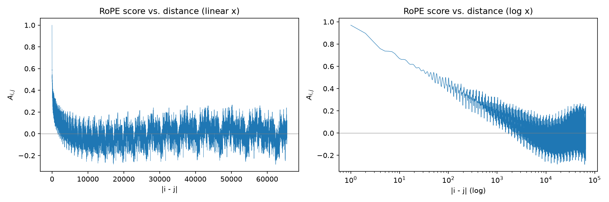

# CS6180 Homework 1

Code: `q2_rope_plot.py`, `plot_losses.py`, and modified `nanoGPT/` (`model.py`, `train.py`, `config/hw1_base.py`, `run_hw1.sh`).

---

## Q1. Convolution

**1.1** Output size = (4 − 3)/1 + 1 = **2×2**.

**1.2** im2col turns each 3×3 patch into a column, so X_col is 9×4. Column (r,c) is vec(X[r:r+3, c:c+3]).
With w = vec(W)ᵀ (1×9): **Y = w · X_col** (1×4), reshaped to 2×2.

GPU advantage: the convolution becomes one big dense GEMM. That means highly optimized BLAS kernels (cuBLAS, Tensor Cores), regular memory access and high parallelism, and many filters and images handled in a single call. Cost: extra memory, because pixels are duplicated (36 vs 16 entries).

**1.3** With g = vec(G):

  ∂L/∂X_col = wᵀ g (9×4),  **∂L/∂X = col2im(wᵀ g)**, where col2im sums overlapping entries.

Equivalently, this is a full convolution of the zero-padded G with the 180°-rotated kernel:

  **∂L/∂X = conv(pad(G, 2), rot180(W))**, i.e. ∂L/∂X[p,q] = Σ_{r,c} G[r,c] · W[p−r, q−c].


---

## Q2. RoPE

**2.1** (R_i q)ᵀ(R_j k) = qᵀ R_{j−i} k. For each of the 64 rotated pairs, with a = 1/√128:

  [a, a] · Rot(Δθ_m) · [a, a]ᵀ = 2a² cos(Δθ_m)  (the sin terms cancel).

Summing over the pairs:

  **A_{i,j} = (1/64) Σ_{m=0}^{63} cos((i − j) θ_m),  θ_m = 10000^(−2m/128)**

This is the score before the 1/√d scaling and softmax.

**2.2**


**2.3** The score decays quickly with distance. Beyond a few thousand tokens it only oscillates around 0, so far positions carry no useful signal. Also, positions longer than the training length produce rotation angles the model never saw, so RoPE does not extrapolate past its training context.

Mitigations:
- Position Interpolation (rescale positions)
- NTK-aware scaling / a larger RoPE base
- YaRN
- Fine-tuning on longer sequences
- ALiBi as an alternative

---

## Q3. Grammar error correction model

**Architecture.** A Transformer encoder-decoder (like BART/T5):
- **Tokenizer:** BPE, 32k vocab.
- **Embedding:** token embedding (d = 768) plus positional encoding.
- **Encoder (6–12 layers):** bidirectional multi-head self-attention, then an FFN (768→3072→768, GELU), each with LayerNorm and a residual. It reads the whole erroneous sentence.
- **Decoder (6–12 layers):** causal self-attention, cross-attention to the encoder output, and an FFN, each with LayerNorm and a residual.
- **Output:** linear layer + softmax over the vocabulary.

```
wrong sentence → [Embedding] → [Encoder × N] ─┐
                                              ▼
shifted target → [Embedding] → [Decoder × N (self-attn, cross-attn, FFN)] → [Linear + Softmax] → corrected sentence
```

**Input / output.** Input: the ungrammatical sentence. Output: the corrected sentence, generated token by token (a copy if it is already correct).

**Training:**
- **Data:** start from a pretrained BART/T5, train on synthetic error pairs, then fine-tune on real GEC data (Lang-8, FCE, W&I+LOCNESS).
- **Loss:** token-level cross-entropy with teacher forcing (label smoothing 0.1).
- **Optimizer:** AdamW (β = 0.9/0.98, weight decay 0.01), lr 3e-5 for fine-tuning with 1k warmup steps then linear decay, batch ~64 sentences, ~20k–50k steps, early stopping on the dev set.
- **Inference / evaluation:** beam search at inference; F0.5 (ERRANT) for evaluation.

---

## Q4. Mini-LLM (nanoGPT)

_Results are filled in after the runs finish._
